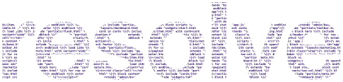

<p align="center">
    <picture>
        <source media="(prefers-color-scheme: dark)" srcset="assets/resolve-wordmark-on-dark.svg">
        <source media="(prefers-color-scheme: light)" srcset="assets/resolve-wordmark-on-light.svg">
        
    </picture>
</p>

&nbsp;

<p align="center">
    A Django template compiler in Rust that flattens inheritance and includes into plain HTML files.
</p>

<p align="center">
    <a href="https://github.com/braycarlson/resolve/actions/workflows/ci.yml"></a>
    <a href="https://www.rust-lang.org"></a>
    <a href="LICENSE"></a>
</p>

## Overview

Django resolves `` and `` on every render. This compiler does
that work once, ahead of time, and writes the result as a flat template Django can load
without walking the inheritance chain again.

## Features

- **Two front ends**: The `resolve` binary is a command-line tool, and the same compiler
  ships to Python as `django-resolve` through PyO3.
- **Incremental**: A cache directory tracks file hashes, so a second run recompiles only
  what changed.
- **Atomic output**: A compile writes to a staging directory and swaps it into place. The
  previous output stays beside it, and a swap interrupted partway is recovered from a
  journal on the next run.
- **Entry discovery**: The compiler finds the templates nothing extends and compiles
  those. Every other template is copied through unchanged.
- **Vendor templates**: The compiler can pull templates out of installed packages in a
  virtual environment, so a project's own overrides resolve against them.
- **Validation**: A separate pass checks the tree without writing anything, with bounds on
  include depth and inheritance depth.

## Install

The command-line tool builds from the workspace, and `default-members` points at it, so a
bare `cargo build` produces it.

```
git clone https://github.com/braycarlson/resolve
cd resolve
cargo build --release
```

The Python package is `django-resolve`, built from `crates/bindings` with maturin. Nothing
is published to PyPI yet, so the wheel is built and installed from the checkout.

```
maturin build --profile release-python --manifest-path crates/bindings/Cargo.toml
pip install --find-links target/wheels django-resolve
```

## Usage

The compiler reads `resolve.toml` from the working directory, or from `--config`, or it
auto-detects a Django layout given `--project`.

| Command | What it does |
|---|---|
| `resolve compile` | The full compile of every entry template. |
| `resolve compile --template <path>` | The compile of one template. |
| `resolve compile --dry-run` | The plan, printed without writing anything. |
| `resolve validate` | The validation pass over the whole tree. |
| `resolve vendor sync` | The vendor template pull from the virtual environment. |
| `resolve clean` | The removal of the cache, vendor, and output directories. |

```console
$ resolve --config resolve.toml compile
resolve v0.1.0

Config (resolve.toml)
  1 template directory
  venv: none
  output: templates/compiled
  cache: .resolve (incremental)
  vendor: templates/vendor (disabled)

Vendor
  0 templates synced

Scan
  3 templates found
  1 entry, 2 non-compiled

Compile (1 templates)
  page.html

Copy (2 templates)
  _nav.html
  base.html

Done in 0.03s (1 compiled, 0 failed, 2 copied)
```

A `page.html` that extends `base.html` and includes `_nav.html` lands in the output
directory as one file, with the block filled and the include pasted in place.

## Configuration

The file is `resolve.toml`, and only `[compiler]` and `[paths]` are required. A
`vendor_directory` has to be set even when the vendor step is off.

```toml
[compiler]
output_directory = "templates/compiled"
cache_directory = ".resolve"

[paths]
primary_templates = ["templates"]
app_templates = []

[vendor]
auto_detect = false
vendor_directory = "templates/vendor"

[entry_templates]
auto_discover = true

[validation]
max_include_depth = 20
max_inheritance_depth = 10

[incremental]
enabled = true
track_file_hashes = true
```

## Python

The module is `resolve` and each command is a function. The arguments mirror the
configuration rather than a file, so a management command can drive it directly.

```python
import resolve

resolve.compile_all(
    template_directories=['templates'],
    output_directory='templates/compiled',
    cache_directory='.resolve',
    vendor_directory='templates/vendor',
    verbose=True,
)
```

The module also carries `compile_single`, `dry_run`, `validate`, `vendor_sync`,
`vendor_status`, and `clean`.

## Development

The workspace holds five crates: `resolve` for the binary, `compiler` for the lexer,
parser, and resolver, `bindings` for the Python extension, `lint` for the template linter,
and `shared` for the configuration.

| Command | What it runs |
|---|---|
| `cargo build --release` | The command-line binary. |
| `cargo test -p compiler -p resolve` | The compiler and binary test suites. |
| `cargo clippy --workspace` | Clippy, which the workspace lints set to deny. |
| `maturin build --profile release-python --manifest-path crates/bindings/Cargo.toml` | The Python wheel. |

## Licence

MIT. See [LICENSE](LICENSE).
